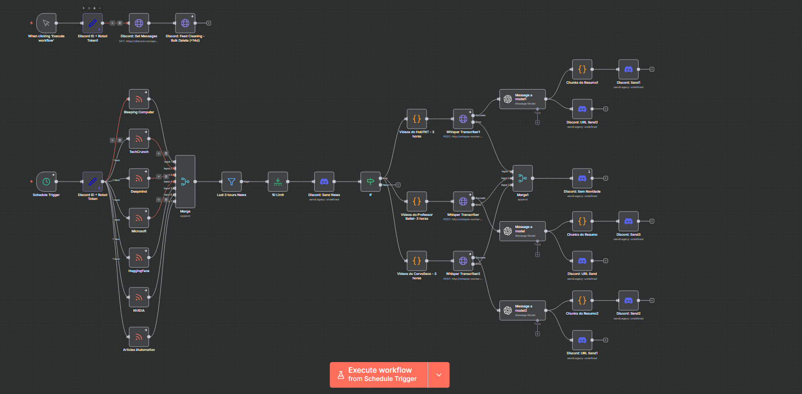

## n8n Transcription Stack

This stack runs an n8n instance alongside a Python worker container that ships with `ffmpeg`, OpenAI Whisper, and CUDA-enabled PyTorch. It provides an out-of-the-box environment for building n8n workflows that rely on speech-to-text transcription and can leverage GPU acceleration when available.

### Prerequisites
- Docker 20.10+
- Docker Compose plugin v2+
- NVIDIA GPU with recent drivers
- NVIDIA Container Toolkit configured on the host (required so Docker exposes GPUs to the container)

### Usage
1. Build and start the services (GPU devices are requested automatically):
   ```bash
   docker compose up -d --build
   ```
2. Open n8n at http://localhost:5678 and create your workflows. The `whisper-worker` container is available on the internal Compose network (service name `whisper-worker`) for running custom Python scripts that use Whisper/PyTorch.
3. (Optional) Verify GPU access inside the worker:
   ```bash
   docker compose exec whisper-worker python3 -c "import torch; print(torch.cuda.is_available())"
   ```
   A value of `False` means the worker falls back to CPU execution, which still works (albeit slower).

Notes:
- The compose file includes a small init service (`shared-data-permissions`) to set ownership/permissions on the shared `/data` volume for both services.
- GPU access requires a compatible NVIDIA driver and the NVIDIA Container Toolkit installed on the host. If GPUs are not available or provisioned, inference runs on CPU.

### Containers
- `n8n`: Official `n8nio/n8n` image with persistent data volume at `n8n_data_transcription`.
- `whisper-worker`: Python 3.11 image with `ffmpeg`, `openai-whisper`, `torch`, and `torchaudio` preinstalled. A cache volume (`whisper_cache`) is mounted to persist Whisper model downloads.

The n8n container is built from `n8n/Dockerfile` to add `yt-channel-info`. External modules allowed for n8n Function nodes include `jsdom`, `@mozilla/readability`, and `yt-channel-info` (see `NODE_FUNCTION_ALLOW_EXTERNAL` in `docker-compose.yml`).

### Customization
- Adjust environment variables for n8n inside `docker-compose.yml` as required.
- Add your own Python scripts or automation code under `whisper-worker/` and rebuild the image.

### API Endpoints
The worker exposes a FastAPI server on port `8000`:
- `POST /transcribe`: accepts a multipart form upload containing an audio/video file (`file` field). Optional query parameters allow changing the Whisper model (`model_name`) and target language (`language`).
- `POST /transcribe-url`: accepts JSON in the shape `{"url": "...", "language": "pt", "model": "base"}` and uses `yt-dlp` to download and transcribe the audio track.

Example request uploading a local file:
```bash
curl -X POST "http://localhost:8000/transcribe?language=en&model_name=small" \
  -F "file=@/path/to/audio.mp3"
```

Example request pointing at a YouTube URL:
```bash
curl -X POST "http://localhost:8000/transcribe-url" \
  -H "Content-Type: application/json" \
  -d '{"url":"https://www.youtube.com/watch?v=dQw4w9WgXcQ","language":"en","model":"base"}'
```
The API responds with the transcription and the path to the persisted `.txt` file inside the shared `/data` volume.

Health check:
- The compose file defines a healthcheck for the worker at `http://localhost:8000/health`. If you need the container health to gate the n8n startup, add a simple `/health` route to the API, or adjust/remove the healthcheck in `docker-compose.yml`.

### Sample Workflows
- Import any of the JSON workflows under `workflows/` into n8n. For example, `workflows/Feeds & Canais YT-channel-info-version.json` includes a node that calls `http://whisper-worker:8000/transcribe-url` to download and transcribe a YouTube video.
- These examples demonstrate how to POST to the worker from within n8n using the service name `whisper-worker` on the internal network.

### YouTube cookies (optional)
If you need to access private/age/region-restricted videos, supply a Netscape-format cookies file and mount it into the worker:

1. Create a file named `cookies.txt` at the repository root (do not commit real cookies to version control).
2. Ensure the compose mount `./cookies.txt:/cookies.txt:ro` is present, and the environment variable `YDL_COOKIEFILE=/cookies.txt` remains set for the `whisper-worker` service in `docker-compose.yml`.
3. If you don't need cookies, you can leave the mount as-is without the file, or remove both the mount and `YDL_COOKIEFILE` environment variable.


---

